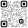
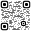
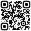

# @verevoir/qr

Text to QR code in TypeScript. Twelve SVG styles — including two that sample a source image for photo and logo overlays — two corner treatments, PNG export. Zero dependencies.

```bash
npm install @verevoir/qr
```

## Styles

Eight hundred words of spec is one picture:

| squares | dots | horizontal | diagonal | metro |
| --- | --- | --- | --- | --- |
|  |  |  |  |  |

Plus diamonds, vertical, network, circuit, and scribble. Same data, different visual treatment; any of them scans.

Two image-driven styles round it out:

- **`photo`** — dot-density modulates from a source image. Dark regions get big dark dots, light regions get small ones; light modules in dark regions render as a dark ring with a small light centre so the decoder still sees them. The image emerges from the dot pattern itself — no background image needed in the output.
- **`logo`** — sparse dots overlaid on a composited source image. Each module is rendered only where the image can't carry the contrast on its own, using the ISO/IEC 15415 reflectance bands as thresholds. You place the image in the DOM behind the SVG; the QR adds the minimum necessary ink on top.

## Quick start

```typescript
import { encode, toSvg } from '@verevoir/qr';

const results = encode('https://example.com');
const svg = toSvg(results[0], { style: 'dots', cornerStyle: 'rounded' });

// svg is a complete SVG string — set as innerHTML, write to disk,
// drop in a React component, whatever.
```

`encode` returns an array of mask candidates ranked by visual quality. Most libraries pick one for you; this one lets you pick — what looks best depends on the style you're rendering with.

## Why it exists

- **Zero dependencies.** GF(256) arithmetic, Reed-Solomon error correction, mask evaluation, SVG rendering — all self-contained TypeScript.
- **Twelve built-in styles.** Most libraries ship one (filled squares). Scanning-reliable variations — dots, diamonds, traced networks, bezier scribbles, plus two image-driven styles (`photo`, `logo`) — let you design instead of settle.
- **SVG out by default.** QR codes are grids; vectors scale perfectly and work in any CAD / fabrication tool. PNG export is there when you need pixels.
- **Outline tracing.** The `square` and grid-based styles trace connected regions as single paths rather than thousands of rectangles. Smaller files, cleaner output.
- **Layer separation.** The `dots` renderer outputs dark and light modules as separate `<g>` groups — useful for multi-colour prints and laser cutting.

## Picking a style

```typescript
import { encode, toSvg } from '@verevoir/qr';
import type { SvgStyle } from '@verevoir/qr';

const qr = encode('https://verevoir.io')[0];

const styles: SvgStyle[] = [
  'square', 'dots', 'diamonds',
  'horizontal', 'vertical', 'diagonal',
  'network', 'circuit', 'metro', 'scribble',
  // Image-driven — each requires a PhotoSampler:
  'photo', 'logo',
];

for (const style of styles) {
  const svg = toSvg(qr, { style, cornerStyle: 'rounded' });
  // Distinct visual treatment of the same data
}
```

## PNG (browser)

```typescript
import { encode, toSvg, svgToPng, downloadPng } from '@verevoir/qr';

const svg = toSvg(encode('https://example.com')[0], { style: 'square' });

// As a blob
const blob = await svgToPng(svg, { size: 1024 });

// Or trigger a download
await downloadPng(svg, { size: 1024, filename: 'qr-code.png' });
```

Browser-only — uses the native canvas API, no `canvas` package required.

## API

### Encoding

| Export                   | Description                                                                                          |
| ------------------------ | ---------------------------------------------------------------------------------------------------- |
| `encode(text, options?)` | Encode text into QR matrix. Returns `QrResult[]` — multiple mask candidates sorted by penalty score. |

### Rendering

| Export                       | Description                                             |
| ---------------------------- | ------------------------------------------------------- |
| `toSvg(qrResult, options?)`  | Render a QR result as an SVG string.                    |
| `svgToPng(svg, options?)`    | Convert SVG string to PNG blob (browser only).          |
| `downloadPng(svg, options?)` | Render to PNG and trigger file download (browser only). |

### Options

| Type          | Values                                                                                                                                              | Default    |
| ------------- | --------------------------------------------------------------------------------------------------------------------------------------------------- | ---------- |
| `SvgStyle`    | `'square'` \| `'dots'` \| `'diamonds'` \| `'horizontal'` \| `'vertical'` \| `'diagonal'` \| `'network'` \| `'circuit'` \| `'metro'` \| `'scribble'` \| `'photo'` \| `'logo'` | `'square'` |
| `CornerStyle` | `'square'` \| `'rounded'`                                                                                                                           | `'square'` |
| `LineWidth`   | `'normal'` \| `'thin'`                                                                                                                              | `'normal'` |
| `ErrorLevel`  | `'L'` \| `'M'` \| `'Q'` \| `'H'`                                                                                                                    | `'L'`      |

### SVG styles

| Style        | Description                                            |
| ------------ | ------------------------------------------------------ |
| `square`     | Filled squares per module (default)                    |
| `dots`       | Round dots — dark and light on the same layer          |
| `diamonds`   | Diamond-shaped modules rotated 45°                     |
| `horizontal` | Horizontal line segments                               |
| `vertical`   | Vertical line segments                                 |
| `diagonal`   | Diagonal line segments                                 |
| `network`    | Connected traced paths with diamond tips               |
| `circuit`    | Connected traced paths with circular tips              |
| `metro`      | Layered horizontal, vertical and diagonal lines        |
| `scribble`   | Connected component walking with bezier-smoothed turns |
| `photo`      | Dot-density modulates from an image sampler. Dark-dot diameter tracks local darkness; light modules in dark regions render as a dark ring with a small light centre. Requires `photo: { sample }`. |
| `logo`       | Sparse dots overlaid on a composited source image. Two-threshold cull per ISO/IEC 15415 — `lum < 0.4` / `lum > 0.7` by default. Requires `logo: { sample }`. |

### Image-driven styles

`photo` and `logo` take a curried `PhotoSampler`:

```typescript
import { encode, toSvg } from '@verevoir/qr';
import { imageToSampler } from '@verevoir/qr/web';

const img = new Image();
img.src = '/portrait.jpg';
await img.decode();

const [qr] = encode('https://example.com', { boostErrorCorrection: true });
const svg = toSvg(qr, {
  style: 'photo',
  photo: { sample: imageToSampler(img) },
});
```

`imageToSampler` takes any `CanvasImageSource` — `HTMLImageElement`, `HTMLCanvasElement`, `ImageBitmap`, `SVGImageElement`, etc. — rasterises it at the QR's module resolution (aspect-preserving letterbox on white), and returns a sampler the renderer consumes. The core library stays DOM-free; Node consumers can write their own sampler around `sharp`, `node-canvas`, or any other source.

For `logo`, composite the source image behind the SVG yourself (DOM layering, or an `<image>` tag inside a wrapping SVG). The QR only emits the dots that are strictly needed; the underlying image carries the rest.

Neither style is surfaced through the `@verevoir/qrcode` shim — the `node-qrcode` API has no way to pass a sampler callback.

### Reserving space for a logo

If you want to cover the centre of a QR with a logo image (any style, not just `logo`), pass `logoArea` to `encode`. The encoder forces H-level error correction and picks a version large enough that the covered area fits inside the recovery budget:

```typescript
const [qr] = encode('https://example.com', { logoArea: 0.15 });
const svg = toSvg(qr, { style: 'square' });
// Composite a 15%-area logo over the centre of the rendered SVG.
```

Recommended range `0.05`–`0.25`. Values above ~0.30 exceed H's practical recovery and will usually fail to scan. If the data is too large for any version at the requested ratio, `encode` throws `"content is too large"`.

## Coming from `node-qrcode`?

[`@verevoir/qrcode`](https://www.npmjs.com/package/@verevoir/qrcode) is an API-compatible wrapper. Same method names (`toString`, `toFile`, `toBuffer`, `toCanvas`, `toDataURL`), so existing call sites migrate without code rewrites — you just change the import. Use `@verevoir/qr` directly when you want the full control; use `@verevoir/qrcode` when you're swapping in behind existing code.

## Part of Verevoir

`@verevoir/qr` is standalone — zero Verevoir dependencies, fine as a single-purpose library. It's also the QR engine behind [Verevoir's](https://verevoir.io) hosted shortener/tracker and the [Slinqi](https://slinqi.io) service. If you need link tracking or URL shortening alongside, [`@verevoir/link-tracking`](https://www.npmjs.com/package/@verevoir/link-tracking) composes with this.

## Acknowledgements

The encoding engine was built with the help of Massimo Artizzu's excellent ["Let's Develop a QR Code Generator"](https://dev.to/maxart2501/let-s-develop-a-qr-code-generator-part-i-basic-concepts-510a) series on Dev.to, which walks through the QR specification from first principles.

## License

MIT
